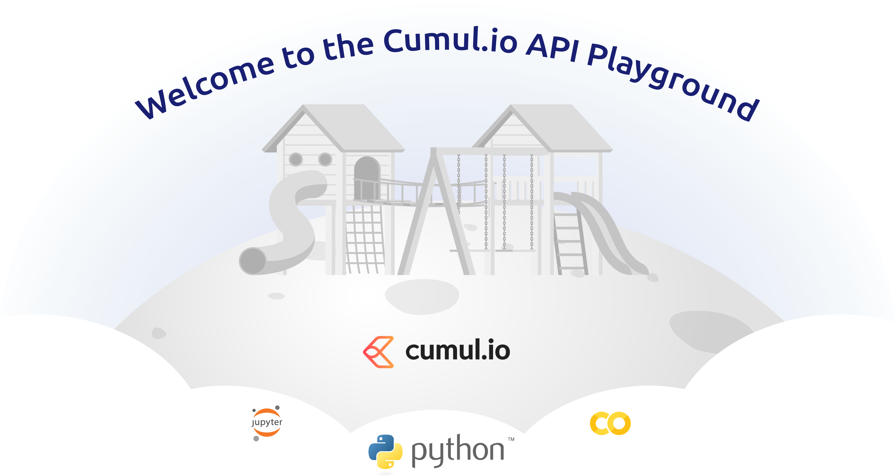

# The Cumul.io API Playground with the Python SDK



This project is hosted as a GitHub page [here](https://cumulio.github.io/api-playground/)

We provide a selection of Jupyter Notebooks with template code to perform some operations via the Cumul.io API. Such as creating datasets and dashboards, updating them etc.

The examples use the [Cumul.io Python SDK](https://pypi.org/project/cumulio/)

The Jupyter Notebooks are hosted on Google Colab. Once you go to them via the [GitHub page](https://cumulio.github.io/api-playground), it will be opened in your Google account. Any edits you make will not be affecting the template we provide. You can even save your version of it to your Drive or GitHub (go to File -> Save a copy to Drive or GitHub). To play around with the code and run the examples, simply press the play button on the top left of each code cell or press Shift + Enter.

## Instructions for running locally:

You will need [Vite](https://vitejs.dev/guide/)

(`npm init vite@latest -- --template vanilla`)

1. `npm install`
2. `npm run build`
3. `npm run serve`
4. Go to `localhost:5000`

## To add a Python Notebook

1. Add a notebook with your desired name in `./notebooks`.
2. Add a button for your notebook in `index.html` that will open it up on Google Colab (simply replace the name in the URL and button as below):

```
<sp-button size="xl" variant="secondary" href=" https://colab.research.google.com/github/cumulio/api-playground/blob/main/notebooks/YOUR_NOTEBOOK_NAME.ipynb" target="_blank">
            
            Name of Your Notebook
          </sp-button>
```

Commit and push your changes (or open a PR), the change will soon reflect on the [GitHub Page](https://cumulio.github.io/api-playground/)
